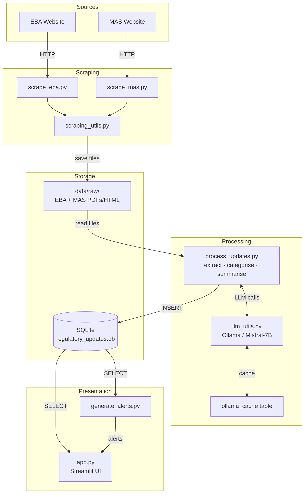

# Architecture

This document describes the components and data flow of the IT Risk Manager Agent.

## Overview

The agent scrapes regulatory updates from EBA and MAS, processes them through an LLM pipeline, stores them in SQLite, and surfaces them via a Streamlit web interface.

## Component Diagram



## Components

| Component | File | Responsibility |
|---|---|---|
| EBA Scraper | `scripts/scrape_eba.py` | Scrapes EBA publications, saves raw PDFs/HTML |
| MAS Scraper | `scripts/scrape_mas.py` | Scrapes MAS publications, consultations, regulations |
| Scraping Utils | `scripts/scraping_utils.py` | Shared HTTP session, filename, download helpers |
| Processor | `scripts/process_updates.py` | Extracts text, classifies, summarises, stores in DB |
| LLM Utils | `scripts/llm_utils.py` | Ollama/Mistral integration with SQLite response cache |
| Alert Generator | `scripts/generate_alerts.py` | Formats DB records into audience-targeted alerts |
| Streamlit UI | `app.py` | Web dashboard — filter, view, generate alerts, trigger scraping |
| Config | `config.py` | Central env-var-backed configuration |

## Data Flow

1. **Scrape** → EBA/MAS websites → raw files saved to `data/raw/{eba,mas}/`
2. **Process** → text extraction → LLM classification + summarisation → SQLite `updates` table
3. **Present** → Streamlit reads `updates`, displays cards, generates alerts per audience

## Database Schema

```sql
-- Core table
CREATE TABLE updates (
    id              INTEGER PRIMARY KEY AUTOINCREMENT,
    title           TEXT NOT NULL,
    source_url      TEXT,
    file_path       TEXT,
    publication_date TEXT,
    processed_date  TEXT DEFAULT CURRENT_TIMESTAMP,
    raw_text        TEXT,
    summary         TEXT,
    risk_area       TEXT,
    urgency_level   TEXT,
    source          TEXT DEFAULT 'EBA',   -- 'EBA' | 'MAS'
    is_processed    BOOLEAN DEFAULT 0
);

-- Indexes
CREATE INDEX idx_publication_date   ON updates(publication_date);
CREATE INDEX idx_risk_area          ON updates(risk_area);
CREATE INDEX idx_urgency            ON updates(urgency_level);
CREATE INDEX idx_is_processed       ON updates(is_processed);
CREATE INDEX idx_source             ON updates(source);
CREATE INDEX idx_source_risk_area   ON updates(source, risk_area);
CREATE INDEX idx_source_urgency     ON updates(source, urgency_level);
```

## Deployment

The application is containerised with Docker Compose:

- **`app`** — Streamlit UI (port 8501), depends on `ollama` being healthy
- **`ollama`** — Mistral-7B LLM server (port 11434), persistent model data via `ollama-data` volume
- **`ollama-setup`** — One-shot container that pulls the `mistral` model on first run

See `docker-compose.yml` and `Dockerfile` for details.
